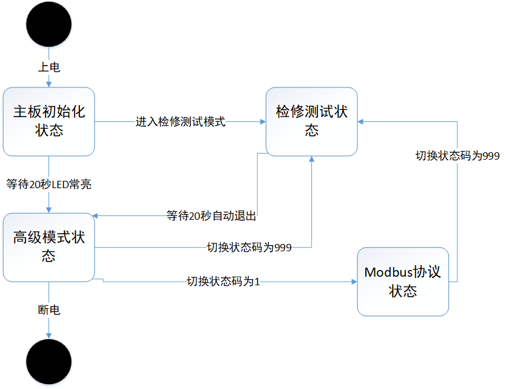
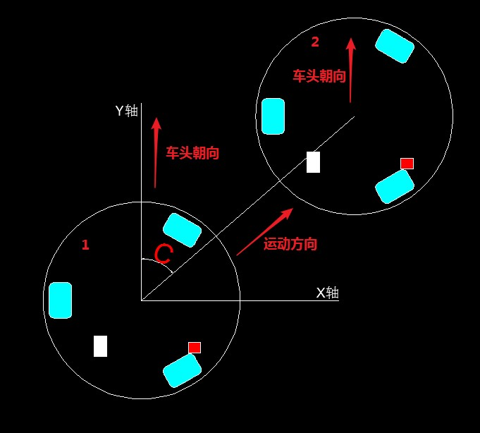

# 领航者系列控制指令

## 内容介绍

&emsp;&emsp;领航者 `API` 手册详细地描述了控制领航者系列机器人的全部指令接口规范。用于标准化底盘与上位机的通信，使得上位机更快更好地控制领航者运动。

## 指令使用介绍

### 指令的硬件环境基础

&emsp;&emsp;指令基于串口通信的硬件基础下实现，通信速率为 `115200Bps` ,数据位为 `8`，校验位为 `None`，停止位为`one`，流控为 `None`。

### 3 种指令模式

| 模式号 | 模式名称 | 数据格式标准 | 模式描述 |
|  ----  | ----  |  ----  | ----  |
| 0 | 高级模式 | JSON 格式 | 内置 PID 控速，陀螺仪导航，刹车等算法 |
| 1 | Modbus 协议模式 | Modbus 协议帧 | 使用 Modbus 协议单独控制每个传感器、执行器 |
| 999 | 检修测试模式 | JSON 格式 | 用于检修调试，检测各组件的健康状况 |

### 指令模式切换

&emsp;&emsp;`3` 种状态均可通过模式号的切换进行改变，并且在每个模式中均包含模式号的切换接口方法。详细的状态转换情况如下图所示：



## 高级模式

### 高级 API 格式概况

&emsp;&emsp;我们将自始至终使用以下 `JSON` 格式的键值对命令对领航者进行控制。

``` json
{
    "o": 0,
    "v": 0,
    "c": 0,
    "d": 0,
    "r": 0,
    "a": 0
} 
```

&emsp;&emsp;指令以 `JSON` 格式构成，一共有 `o,v,c,d,r,a` 这 `6` 个键和与之对应的 `6` 个值数据构成。下表记录了对于这几个键的详细描述。

| `JSON` 键 | 名称 | 范围 | 一般值 | 说明 |
|  ----  | ----  |  ----  | ----  | ----  |
| o | 模式位 | `[0,正无穷]` | `0|1|999` | 大于 `1` 表示激活领航者并初始化陀螺仪数据。电机转动运行过程中值必须为 `0` |
| v | 速度 | `[0,150]` | `[0,100]` | 电机运行的相对速率，可用于控制车速 |
| c | 平移角度 | `[0,正无穷]` | `[0,359]` | 在平面直角坐标系中平移运动的方向 |
| d | 自转方向 | `[0,正无穷]` | `0|1` | 自转，转弯方向，大于 `0` 时表示顺时针旋转，等于 `0` 表示逆时针旋转 |
| r | 自转速率 | `[0,正无穷]` | `[0,正无穷]` | 自转速率（`r` 毫秒每转） |
| a | 计划旋转角度 | `[0,360]` | `[0,360]` | 自转固定度数 `a` |

&emsp;&emsp;我们可以用以下两个命令来控制车，体验一下实际的作用。

``` python
#速率20，向正前方向行驶 
{'o': 0, 'v': 20, 'c': 0, 'd': 0, 'r': 0, 'a': 0}) 
#速率50，向正前方向行驶 
{'o': 0, 'v': 50, 'c': 0, 'd': 0, 'r': 0, 'a': 0})
```

### 横向平移高级 API

&emsp;&emsp;领航者可以支持横向运动，就像螃蟹爬那样，利用设置键 `c` 的值就可以控制平移运动的角度。所谓平移运动就是保持车头的方向不变，车体向任意一个方向发生平移。如下图所示，从 `1` 移动到 `2` 的过程就属于平移。运动方向是与 `Y` 轴在顺时针方向的夹角。



&emsp;&emsp;我们可以用以下几个指令来控制领航者，体验一下 `c` 的实际用途。

``` python
#速率20，向90度方向行驶 
{'o': 0, 'v': 20, 'c': 90, 'd': 0, 'r': 0, 'a': 0}
#速率20，向180度方向行驶（后退） 
{'o': 0, 'v': 20, 'c': 180, 'd': 0, 'r': 0, 'a': 0}
```

### 定速旋转高级 API

&emsp;&emsp;领航者能以固定的速度进行自转，这里用到了 `d` 和 `r` 两个参数，其中 `d` 表示自转的方向，`d` 的值为 `0` 表示将逆时针旋转，`d` 的值不为 `0` 时表示将顺时针旋转。`r` 的值代表旋转一圈所需的毫秒数，这个值越小理论上转得越快，但是由于领航者所在的物理世界局限性，使得这个值不能低于 `1200`，也就是领航者最快是 `1.2` 秒自转一圈。可以用以下几个指令来控制领航者，体验一下 `d,r` 的实际用途。

``` python
#以10秒钟一圈的速率朝逆时针方向一直旋转 
{'o': 0, 'v': 0, 'c': 0, 'd': 0, 'r': 10000, 'a': 0}
#以10秒钟一圈的速率朝顺时针方向一直旋转 
{'o': 0, 'v': 0, 'c': 0, 'd': 1, 'r': 10000, 'a': 0}
#以3秒钟一圈的速率朝顺时针方向一直旋转 
{'o': 0, 'v': 0, 'c': 0, 'd': 1, 'r': 3000, 'a': 0}
```

### 旋转固定角度高级 API

&emsp;&emsp;很多时候我们希望领航者能只旋转一个恰到好处的固定角度,这时就需要用到 `a`，`a` 表示自转的角度，取值范围从 `1` 到正无穷都可以取，需要配合定速旋转中的 `r` 和 `d` 参数一起使用。可以用以下几个指令来控制领航者，体验一下 `a` 的实际用途。

``` python
#以3秒钟一圈的速率朝顺时针方向 旋转90度停下 
{'o': 0, 'v': 0, 'c': 0, 'd': 1, 'r': 3000, 'a': 90}
#以3秒钟一圈的速率朝顺时针方向 旋转360度停下 
{'o': 0, 'v': 0, 'c': 0, 'd': 1, 'r': 3000, 'a': 360}) 
```

### 更多高级API示例 

``` python
# 顺时针方向以每 10000 毫秒每转的速率旋转 45 度 
{"o":0,"v":0,"c":0,"d":1,"r":10000,"a":45} 
# 逆时针方向以每 10000 毫秒每转的速率旋转 270 度 
{"o":0,"v":0,"c":0,"d":0,"r":10000,"a":270} 
# 以 100 的速率在平面直角坐标系中向 45 度方向保持车头朝向不变平移前进 
{"o":0,"v":10,"c":45,"d":0,"r":0,"a":0} 
# 逆时针方向以每 10000 毫秒每转的速率持续旋转 
{"o":0,"v":0,"c":0,"d":0,"r":10000,"a":0} 
# 顺时针方向以每 10000 毫秒每转的速率持续旋转 
{"o":0,"v":0,"c":0,"d":1,"r":10000,"a":0} 
# 顺时针方向以每 10000 毫秒每转的速率持续旋转的同时以 50 的速率在平面直角坐标系中向 0 度方向保持车头朝向不变平移前进（一般用于车辆右转弯） 
{"o":0,"v":50,"c":0,"d":1,"r":10000,"a":0} 
# 逆时针方向以每 10000 毫秒每转的速率持续旋转的同时以 50 的速率在平面直角坐标系中向 0 度方向保持车头朝向不变平移前进（一般用于车辆左转弯） 
{"o":0,"v":50,"c":0,"d":0,"r":10000,"a":0} 
```

### Modbus 协议模式

&emsp;&emsp;月球仔 `modbus` 通信地址为 `0x0007`，其具体寄存器内容表如下表所示：

| 地址 | 变量名称 | 读写属性 | 数据格式 | 符号 | 数据类型 |
|  ----  | ----  |  ----  | ----  | ----  | ----  |
| 0000H | 模式号 | R/W | X号 | 无符号 | Word |
| 0001H | 陀螺仪俯仰轴数据 | R | XXX.XX_度 | 无符号 | Word |
| 0002H | 陀螺仪横滚轴数据 | R | XXX.XX_度 | 无符号 | Word |
| 0003H | 陀螺仪航向轴数据 | R | XXX.XX_度 | 无符号 | Word |
| 0004H | R 电机固定周期内码盘脉冲次数 | R | X_次/检测周期（毫秒） | 无符号 | Word |
| 0005H | B 电机固定周期内码盘脉冲次数 | R | X_次/检测周期（毫秒） | 无符号 | Word |
| 0007H | R 电机目标转速控制 | R/W | X_次码盘脉冲/检测周期（毫秒） | 无符号 | Word |
| 0008H | R 电机目标转向控制 | R/W | 1_顺时针，0_逆时针 | 无符号 | Word |
| 0009H | B 电机目标转速控制 | R/W | X_次码盘脉冲/检测周期（毫秒） | 无符号 | Word |
| 000AH | B 电机目标转向控制 | R/W | 1_顺时针，0_逆时针 | 无符号 | Word |
| 000BH | C 电机目标转速控制 | R/W | X_次码盘脉冲/检测周期（毫秒） | 无符号 | Word |
| 000CH | C 电机目标转向控制 | R/W | 1_顺时针，0_逆时针 | 无符号 | Word |
| 000DH | 采样周期 | R/W | 1-65534毫秒 | 无符号 | Word |
| 000EH | 轮速控制 PID 算法 P 参数 | R/W | 1-65534 | 无符号 | Word |
| 000FH | 轮速控制 PID 算法 I 参数 | R/W | 1-65534 | 无符号 | Word |
| 0010H | 轮速控制 PID 算法 D 参数 | R/W | 1-65534 | 无符号 | Word |
| 0011H | 刹车按钮状态 | R | 1_按钮按下，0_按钮松开 | 无符号 | Word |
| 0012H | 保留位 | 保留位 | 保留位 | 无符号 | Word |
